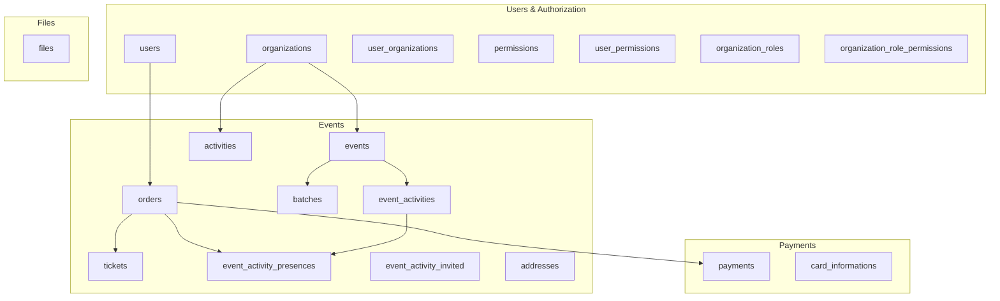

# Relacionamentos do banco de dados

Documentação derivada das entidades TypeORM em `src/**/infra/orm/entities/`.  
Para DDL executável, veja [`schema.sql`](./schema.sql). Para diagramas, veja [`er-diagram.mmd`](./er-diagram.mmd) e [`schema.dbml`](./schema.dbml).

---

## Convenções globais

Todas as tabelas de domínio estendem `BaseEntitySequentialGeneratedUUID`:

| Coluna       | Tipo          | Descrição                                                                                   |
| ------------ | ------------- | ------------------------------------------------------------------------------------------- |
| `id`         | `UUID`        | Chave primária. Gerada com **UUID v7** no hook `@BeforeInsert` se não informada.            |
| `created_at` | `timestamptz` | Preenchida automaticamente na criação.                                                      |
| `updated_at` | `timestamptz` | Atualizada automaticamente em cada `UPDATE`.                                                |
| `deleted_at` | `timestamptz` | **Soft delete**. Registros com valor não-nulo são ignorados pelo TypeORM em queries padrão. |

**Onde está no código:** `src/shared/infra/orm/entities/base-entity-sequential-generated-uuid.entity.ts`

---

## Visão por domínio



---

## Módulo: Users & Authorization

### `users` ↔ `organizations` via `user_organizations`

| Aspecto               | Detalhe                                                                                                 |
| --------------------- | ------------------------------------------------------------------------------------------------------- |
| **Cardinalidade**     | N:N                                                                                                     |
| **Tabela de junção**  | `user_organizations`                                                                                    |
| **FKs**               | `user_id` → `users.id`, `organization_id` → `organizations.id`                                          |
| **Lado User**         | `@OneToMany` → `user_organizations`                                                                     |
| **Lado Organization** | `@OneToMany` → `user_organizations`                                                                     |
| **Significado**       | Um usuário pode pertencer a várias organizações; uma organização tem vários membros.                    |
| **Constraint única**  | Não há `@Unique` na entidade — o mesmo par user/org pode teoricamente duplicar se inserido manualmente. |
| **Código**            | `user.entity.ts`, `organization.entity.ts`, `user-organization.entity.ts`                               |

### `users` + `organizations` + `permissions` via `user_permissions`

| Aspecto           | Detalhe                                                                                                        |
| ----------------- | -------------------------------------------------------------------------------------------------------------- |
| **Cardinalidade** | N:N:N (usuário × organização × permissão)                                                                      |
| **FKs**           | `user_id`, `organization_id`, `permission_id`                                                                  |
| **Constraint**    | `@Unique(['user', 'organization', 'permission'])` — uma permissão por escopo de organização.                   |
| **Significado**   | Permissões são **escopadas por organização**. O mesmo usuário pode ter `event:create` na org A e não na org B. |
| **Código**        | `user-permission.entity.ts`                                                                                    |

### `organizations` → `organization_roles` → `permissions` via `organization_role_permissions`

| Aspecto           | Detalhe                                                                                                                                        |
| ----------------- | ---------------------------------------------------------------------------------------------------------------------------------------------- |
| **Cardinalidade** | 1:N (org → roles), N:N (role ↔ permission)                                                                                                     |
| **FKs**           | `organization_roles.organization_id`, `organization_role_permissions.organization_role_id`, `organization_role_permissions.permission_id`      |
| **Constraint**    | `@Unique(['organization', 'name'])` em roles; `@Unique(['organization_role', 'permission'])` em role_permissions                               |
| **Significado**   | Papéis reutilizáveis por organização (ex: "Admin", "Operador") com conjunto de permissões. Complementa `user_permissions` (atribuição direta). |
| **Código**        | `organization-role.entity.ts`, `organization-role-permission.entity.ts`                                                                        |

### `users` → `orders`

| Aspecto           | Detalhe                                                                                      |
| ----------------- | -------------------------------------------------------------------------------------------- |
| **Cardinalidade** | 1:N                                                                                          |
| **FK**            | `orders.user_id` → `users.id` (`nullable: false`)                                            |
| **Significado**   | Cada pedido pertence a um comprador. Um usuário pode ter vários pedidos (compras distintas). |
| **Código**        | `user.entity.ts`, `order.entity.ts`                                                          |

### `users` → `event_activity_invited` (opcional)

| Aspecto           | Detalhe                                                                                                  |
| ----------------- | -------------------------------------------------------------------------------------------------------- |
| **Cardinalidade** | 1:N                                                                                                      |
| **FK**            | `event_activity_invited.user_id` → `users.id` (`nullable: true`)                                         |
| **Significado**   | Convidado pode existir só com nome/instituição, sem conta no sistema. Se tiver conta, vincula ao `user`. |
| **Código**        | `event-activity-invited.entity.ts`                                                                       |

---

## Módulo: Events

### `organizations` → `events`

| Aspecto           | Detalhe                                                           |
| ----------------- | ----------------------------------------------------------------- |
| **Cardinalidade** | 1:N                                                               |
| **FK**            | `events.organization_id` → `organizations.id` (`nullable: false`) |
| **Significado**   | Todo evento pertence a uma organização produtora.                 |
| **Código**        | `event.entity.ts`                                                 |

### `organizations` → `activities`

| Aspecto           | Detalhe                                                                                    |
| ----------------- | ------------------------------------------------------------------------------------------ |
| **Cardinalidade** | 1:N                                                                                        |
| **FK**            | `activities.organization_id` → `organizations.id`                                          |
| **Significado**   | **Catálogo** de atividades da organização (template). Não é a programação do evento em si. |
| **Código**        | `activity.entity.ts`                                                                       |

### `events` ↔ `addresses` (OneToOne)

| Aspecto           | Detalhe                                                                                  |
| ----------------- | ---------------------------------------------------------------------------------------- |
| **Cardinalidade** | 1:0..1                                                                                   |
| **Dono da FK**    | **`events.address_id`** → `addresses.id`                                                 |
| **Lado Event**    | `@OneToOne` + `@JoinColumn({ name: 'address_id' })`                                      |
| **Lado Address**  | `@OneToOne` inverso sem `@JoinColumn`                                                    |
| **Significado**   | Evento presencial pode ter um endereço. Eventos online podem omitir (`address_id` null). |
| **Código**        | `event.entity.ts`, `address.entity.ts`                                                   |

### `events` + `activities` → `event_activities`

| Aspecto               | Detalhe                                                                                                                            |
| --------------------- | ---------------------------------------------------------------------------------------------------------------------------------- |
| **Cardinalidade**     | N:1 com `events` e N:1 com `activities`                                                                                            |
| **FKs**               | `event_id`, `activity_id` (ambos obrigatórios)                                                                                     |
| **Significado**       | **Instância** de uma atividade do catálogo dentro de um evento específico, com datas, capacidade e regras próprias.                |
| **Regra de negócio**  | `start_date`/`end_date` da `event_activity` devem estar dentro do intervalo do `event` (validado em `CreateEventActivityService`). |
| **Campos de negócio** | `max_participants`, `hours_to_retrieve` (janela para retirar vaga — ainda sem job implementado).                                   |
| **Código**            | `event-activity.entity.ts`                                                                                                         |

### `event_activities` → `event_activity_presences`

| Aspecto            | Detalhe                                                                                                                                                                 |
| ------------------ | ----------------------------------------------------------------------------------------------------------------------------------------------------------------------- |
| **Cardinalidade**  | 1:N                                                                                                                                                                     |
| **FK**             | `event_activity_presences.event_activity_id`                                                                                                                            |
| **FK opcional**    | `order_id` → `orders.id` (`nullable: true`)                                                                                                                             |
| **Significado**    | Ao criar uma `event_activity`, o sistema gera **`max_participants` slots** vazios (`order_id` null, `user_presence` false). Cada slot representa uma vaga na atividade. |
| **Fluxo esperado** | Pedido confirmado deveria ocupar um slot (ainda não implementado no webhook). `user_presence` marca check-in no dia.                                                    |
| **Código**         | `create-event-activity.service.ts`, `event-activity-presence.entity.ts`                                                                                                 |

### `event_activities` → `event_activity_invited`

| Aspecto           | Detalhe                                                                 |
| ----------------- | ----------------------------------------------------------------------- |
| **Cardinalidade** | 1:N                                                                     |
| **FK**            | `event_activity_id` (obrigatório)                                       |
| **Significado**   | Lista de convidados/palestrantes de uma atividade específica do evento. |
| **Código**        | `event-activity-invited.entity.ts`                                      |

### `events` → `batches` → `tickets`

| Aspecto           | Detalhe                                                                                                                                            |
| ----------------- | -------------------------------------------------------------------------------------------------------------------------------------------------- |
| **Cardinalidade** | `events` 1:N `batches` 1:N `tickets`                                                                                                               |
| **FKs**           | `batches.event_id`, `tickets.batch_id`                                                                                                             |
| **Significado**   | Lote define preço (`price`) e quantidade base (`base_quantity`). Na criação do lote, N tickets são gerados automaticamente (`CreateBatchService`). |
| **Código**        | `batch.entity.ts`, `ticket.entity.ts`, `create-batch-and-tickets.service.ts`                                                                       |

### `orders` ↔ `tickets`

| Aspecto                      | Detalhe                                                                                                                                          |
| ---------------------------- | ------------------------------------------------------------------------------------------------------------------------------------------------ |
| **Cardinalidade**            | 1:N (um pedido pode ter vários tickets; hoje o fluxo cria 1 ticket por pedido)                                                                   |
| **FK**                       | `tickets.order_id` → `orders.id` (`nullable: true`)                                                                                              |
| **Significado**              | `order_id` **null** = ingresso disponível. Preenchido = reservado/vendido.                                                                       |
| **Disponibilidade derivada** | Ticket **não tem coluna de status**. `TicketAvailability` é calculado via `resolveTicketAvaliability(ticket)` a partir de `ticket.order.status`. |
| **Código**                   | `ticket.entity.ts`, `resolve-ticket-avaliability.ts`                                                                                             |

| `order.status`                     | `TicketAvailability` |
| ---------------------------------- | -------------------- |
| (sem order)                        | `AVAILABLE`          |
| `PENDING`                          | `RESERVED`           |
| `CONFIRMED`                        | `USABLE`             |
| `DISPUTED`                         | `BLOCKED`            |
| `EXPIRED`, `CANCELLED`, `REFUNDED` | `AVAILABLE`          |

### `orders` → `event_activity_presences`

| Aspecto           | Detalhe                                                                                                                                 |
| ----------------- | --------------------------------------------------------------------------------------------------------------------------------------- |
| **Cardinalidade** | 1:N                                                                                                                                     |
| **FK**            | `event_activity_presences.order_id` (opcional)                                                                                          |
| **Significado**   | Liga a compra (pedido confirmado) a um slot de participação na atividade. Permite rastrear quem comprou vaga em qual workshop/palestra. |
| **Estado atual**  | Slots são criados vazios; vínculo com `order` ainda não ocorre automaticamente no fluxo de pagamento.                                   |

### Cadeia implícita: ticket → evento

Não há FK direta `tickets → events`. O caminho é:

```text
tickets.batch_id → batches.event_id → events.id
```

Consultas por `event_id` em tickets passam pelo join com `batches`.

### `events.configuration` (JSONB)

| Aspecto         | Detalhe                                                                                                                                 |
| --------------- | --------------------------------------------------------------------------------------------------------------------------------------- |
| **Tipo**        | `jsonb`, nullable                                                                                                                       |
| **Significado** | Configurações flexíveis do evento (substitui a antiga tabela `event_configurations`). Atualizado via `UpdateEventConfigurationService`. |
| **Código**      | `event.entity.ts`                                                                                                                       |

---

## Módulo: Payments

### `orders` → `payments`

| Aspecto           | Detalhe                                                                                                                             |
| ----------------- | ----------------------------------------------------------------------------------------------------------------------------------- |
| **Cardinalidade** | 1:N                                                                                                                                 |
| **FK**            | `payments.order_id` → `orders.id` (`nullable: false`)                                                                               |
| **Significado**   | Um pedido pode ter várias tentativas de pagamento (ex: PIX expirado + novo PIX). Cada registro espelha uma interação com o gateway. |
| **Campos**        | `provider` (ex: `abacatepay`), `external_id`, `amount`, `method`, `status`, `refunded_at`                                           |
| **Código**        | `payment.entity.ts`, `create-payment.service.ts`                                                                                    |

### `payments` ↔ `card_informations` (OneToOne)

| Aspecto           | Detalhe                                                                                                                                   |
| ----------------- | ----------------------------------------------------------------------------------------------------------------------------------------- |
| **Cardinalidade** | 1:0..1                                                                                                                                    |
| **Dono da FK**    | **`card_informations.payment_id`** → `payments.id`                                                                                        |
| **Significado**   | Metadados não sensíveis do cartão (últimos 4 dígitos, bandeira, validade). Usado para pagamentos `CREDIT`/`DEBIT`; PIX não cria registro. |
| **Código**        | `card-information.entity.ts`                                                                                                              |

---

## Módulo: Files

### `files` (isolada)

| Aspecto             | Detalhe                                                                                                                                                   |
| ------------------- | --------------------------------------------------------------------------------------------------------------------------------------------------------- |
| **Relacionamentos** | Nenhum FK para outras tabelas no schema atual.                                                                                                            |
| **Significado**     | Metadados de arquivos armazenados (`path` único, `mime_type`). Associação com outros recursos, se houver, é por convenção de path ou camada de aplicação. |
| **Código**          | `file.entity.ts`                                                                                                                                          |

---

## Fluxos de negócio que atravessam relacionamentos

### 1. Venda de ingresso

```text
User
  → (WebSocket) fila RETRIEVE_AVAILABLE_TICKETS
  → Ticket (order_id null) + Order (PENDING) + Ticket.order = Order
  → Payment (PENDING) ligado ao Order
  → Webhook PAID → Order CONFIRMED → TicketAvailability USABLE
```

**Tabelas tocadas:** `users`, `tickets`, `orders`, `payments`, `batches`, `events` (via join).

### 2. Montagem de evento com atividades

```text
Organization
  → Activity (catálogo)
  → Event
  → EventActivity (event + activity)
  → EventActivityPresence × max_participants (slots vazios)
  → Batch → Tickets
```

### 3. Autorização de ação

```text
User + Organization + Permission (user_permissions)
  ou
OrganizationRole + Permission (organization_role_permissions)
```

Usado por `AuthorizeOrganizationActionService` antes de mutações em eventos, lotes, etc.

---

## Diagrama ER completo

O arquivo [`er-diagram.mmd`](./er-diagram.mmd) contém o diagrama Mermaid com todas as entidades e FKs.  
Abra em [mermaid.live](https://mermaid.live) ou visualize no GitHub ao embutir em markdown.

---

## Referência de entidades no código

| Tabela                          | Entidade TypeORM             |
| ------------------------------- | ---------------------------- |
| `users`                         | `User`                       |
| `organizations`                 | `Organization`               |
| `user_organizations`            | `UserOrganization`           |
| `permissions`                   | `Permission`                 |
| `user_permissions`              | `UserPermission`             |
| `organization_roles`            | `OrganizationRole`           |
| `organization_role_permissions` | `OrganizationRolePermission` |
| `files`                         | `StoredFile`                 |
| `addresses`                     | `Address`                    |
| `events`                        | `Event`                      |
| `activities`                    | `Activity`                   |
| `event_activities`              | `EventActivity`              |
| `batches`                       | `Batch`                      |
| `tickets`                       | `Ticket`                     |
| `orders`                        | `Order`                      |
| `event_activity_presences`      | `EventActivityPresence`      |
| `event_activity_invited`        | `EventActivityInvited`       |
| `payments`                      | `Payment`                    |
| `card_informations`             | `CardInformation`            |

Para colunas, tipos e enums detalhados, veja [`tables.md`](./tables.md).
