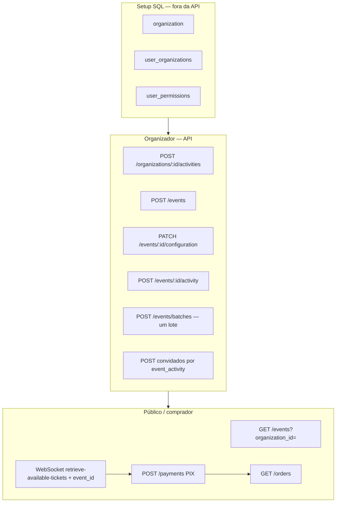

# Action plan — 17/06/26

Plano para atingir o **mínimo funcional** acordado, com premissas explícitas sobre o que fica de fora.

Documentos de apoio: [overview](../overview.md) · [api-inventory](../api-inventory.md) · [mvp-gap](../mvp-gap.md) · [database](../../database/README.md)

---

## Premissas deste plano

| Decisão                      | Detalhe                                                                                                                                                         |
| ---------------------------- | --------------------------------------------------------------------------------------------------------------------------------------------------------------- |
| **Users e organização**      | Setup via **SQL manual** (org, `user_organizations`, `user_permissions`). Não entra API de org/membership neste ciclo.                                          |
| **Lotes**                    | **Um lote ativo por evento** neste ciclo — sem lotes simultâneos, sem escolha de lote na compra. A reserva usa só `event_id` (primeiro ticket livre do evento). |
| **1 ingresso por comprador** | Regra de **frontend**; backend não impõe limite por usuário/lote.                                                                                               |
| **Pagamento**                | PIX (AbacatePay) é suficiente para o mínimo.                                                                                                                    |
| **Concorrência na reserva**  | Worker BullMQ com `concurrency: 1` + uma instância da app no piloto.                                                                                            |
| **Dia do evento**            | Check-in, inscrição em `event_activity_presences`, `hours_to_retrieve` — **fora** deste plano.                                                                  |
| **Webhooks**                 | Só `transparent.completed` precisa funcionar; refunded/disputed/lost ficam para depois.                                                                         |

---

## Objetivo do mínimo

### Organizador (com permissões já no banco)

1. Criar evento (datas, modalidade, endereço opcional)
2. Configurar o evento (`events.configuration` jsonb)
3. Montar catálogo de atividades e vinculá-las ao evento (`event_activities` + slots de presença)
4. Abrir **um lote** por evento (`POST /events/batches` + tickets gerados)
5. Cadastrar **convidados** por atividade do evento

### Participante

1. Ver evento público (programação, convidados, disponibilidade agregada)
2. Comprar **1 ingresso** do evento (WebSocket + `event_id`)
3. Pagar via PIX e ter pedido confirmado
4. Consultar seus pedidos

---

## Fluxo alvo



---

## O que já está pronto

Legenda: ✅ pronto · ⚠️ parcial

### Montagem do evento

| Capacidade                   | Endpoint / código                                                | Status |
| ---------------------------- | ---------------------------------------------------------------- | ------ |
| Criar evento                 | `POST /events`                                                   | ✅     |
| Atualizar / excluir evento   | `PATCH/DELETE /events/:event_id`                                 | ✅     |
| Configuração jsonb           | `GET/PATCH/DELETE /events/:event_id/configuration`               | ✅     |
| Catálogo de atividades       | `CRUD /organizations/.../activities`                             | ✅     |
| Vincular atividade ao evento | `POST /events/:event_id/activity` (+ `event_activity_presences`) | ✅     |
| Listar programação (auth)    | `GET /events/event-activities?event_id=`                         | ✅     |
| Editar / remover programação | `PATCH/DELETE /events/event-activities/:id`                      | ✅     |
| Criar lote + tickets         | `POST /events/batches`                                           | ✅     |
| Listar lotes (auth)          | `GET /events/batches?event_id=`                                  | ✅     |
| Editar / remover lote        | `PATCH/DELETE /events/batches/:id`                               | ✅     |

### Venda e pagamento

| Capacidade                  | Status | Observação                                                     |
| --------------------------- | ------ | -------------------------------------------------------------- |
| Listagem pública de eventos | ✅     | `GET /events?organization_id=` + `available_tickets_count`     |
| Reserva + pedido            | ✅     | WebSocket com `event_id` — adequado com **um lote** por evento |
| PIX + confirmação           | ✅     | `POST /payments` + webhook `completed`                         |
| Worker sequencial           | ✅     | `concurrency: 1` no BullMQ                                     |
| Listar pedidos do usuário   | ⚠️     | `GET /orders` sem join com `tickets` / evento                  |

### Convidados

| Capacidade                       | Status | Observação                              |
| -------------------------------- | ------ | --------------------------------------- |
| Exibir convidados na vitrine     | ✅     | `FindEventsService` já inclui `invited` |
| Cadastrar / gerenciar convidados | ❌     | Service existe, **sem rotas HTTP**      |

---

## O que falta

### P0 — bloqueia o mínimo

| #     | Gap                         | Situação                                                                | Ação                                   |
| ----- | --------------------------- | ----------------------------------------------------------------------- | -------------------------------------- |
| **1** | **API de convidados**       | `CreateEventInvitedService` sem rota; sem find/update/delete            | Rotas + services (ver abaixo)          |
| **2** | **Bug no create convidado** | `user_id` busca por id de `event_activity_invited` em vez de `users.id` | Corrigir vínculo opcional com `User`   |
| **3** | **DTO de convidado**        | `user_id` obrigatório no DTO                                            | `user_id` opcional; `name` obrigatório |

**Rotas sugeridas:**

| Método | Rota                                                      | Permissão              |
| ------ | --------------------------------------------------------- | ---------------------- |
| POST   | `/events/event-activities/:event_activity_id/invited`     | `event_invited:create` |
| GET    | `/events/event-activities/:event_activity_id/invited`     | `event_invited:read`   |
| PATCH  | `/events/event-activities/:event_activity_id/invited/:id` | `event_invited:update` |
| DELETE | `/events/event-activities/:event_activity_id/invited/:id` | `event_invited:delete` |

### P1 — qualidade do mínimo (demo ok; piloto precisa)

| #     | Gap                                   | Por quê importa                                                                    |
| ----- | ------------------------------------- | ---------------------------------------------------------------------------------- |
| **4** | **Pedidos com contexto do ingresso**  | `GET /orders` sem `tickets` → evento. Front não monta “seu ingresso do evento X”   |
| **5** | **Expiração de pedido/PIX**           | `PENDING` segura ticket indefinidamente                                            |
| **6** | **Programação com nome da atividade** | `GET /events/event-activities` sem `activity.name` — útil no painel do organizador |

### Fora deste plano (registrado)

| Item                                | Motivo                                                                  |
| ----------------------------------- | ----------------------------------------------------------------------- |
| **Lotes simultâneos**               | Um lote ativo por evento; sem `batch_id` na compra nem vitrine por lote |
| **Reserva por `batch_id`**          | Só necessário com múltiplos lotes abertos ao mesmo tempo                |
| **Vitrine pública com `batches[]`** | Idem                                                                    |
| API criar organização / membership  | SQL manual neste ciclo                                                  |
| Limite 1 ingresso no backend        | Front                                                                   |
| Reserva atômica no banco            | Piloto com 1 instância + worker sequencial; obrigatório antes de scale  |
| Inscrição em atividade / check-in   | Pós-mínimo                                                              |
| Webhooks refunded / disputed / lost | Stub hoje                                                               |
| Cartão CREDIT/DEBIT                 | Sem gateway                                                             |
| Migrations                          | `DB_SYNCHRONIZE` ok para dev                                            |

---

## Plano de execução

### Fase A — Convidados (P0)

```text
1. Corrigir CreateEventInvitedService + DTO
2. Criar Find / Update / Delete event activity invited
3. Registrar rotas no event.router + controller
4. Garantir permissões EVENT_INVITED_*
```

**Aceite:** organizador faz CRUD de convidados por `event_activity`; vitrine pública lista `invited`.

### Fase B — Experiência do comprador (P1)

```text
1. OrderRepository.find com leftJoin tickets → batch → event
2. Job de expiração: PENDING além do TTL → EXPIRED, ticket liberado
3. (Opcional) expandir activity.name em GET event-activities
```

**Aceite:** usuário vê em `/orders` a qual evento pertence o ingresso; pedidos abandonados liberam estoque.

### Fase C — Validação manual

```text
1. SQL bootstrap (org + permissões)
2. Fluxo organizador: evento → 1 lote → atividades → convidados
3. Fluxo comprador: vitrine → WebSocket → PIX → orders
```

---

## Bootstrap SQL (referência rápida)

Antes de usar a API como organizador, inserir no mínimo:

```sql
-- 1. organization
-- 2. user_organizations (user_id, organization_id)
-- 3. user_permissions (event:*, batch:*, activity:*, event_activity:*,
--    event_configuration:*, event_invited:*)
```

IDs de `permissions` vêm da tabela `permissions` após `SyncPermissionsService` na subida do servidor.

**Operacional:** criar **apenas um** `batch` por evento enquanto lotes simultâneos estiverem fora do escopo.

---

## Checklist de aceite — mínimo 17/06/26

### Organizador (após SQL)

- [ ] Criar atividade no catálogo
- [ ] Criar evento com datas e configuração
- [ ] Adicionar atividades ao evento
- [ ] Criar **um** lote com tickets
- [ ] Cadastrar convidados em uma `event_activity`
- [ ] Ver programação e lote no painel (rotas autenticadas)

### Vitrine / comprador

- [ ] `GET /events` mostra evento, programação, convidados e `available_tickets_count`
- [ ] WebSocket com `event_id` reserva ingresso e cria pedido
- [ ] `POST /payments` gera PIX
- [ ] Webhook confirma pedido
- [ ] `GET /orders` mostra pedido com **evento** identificável (após Fase B)

### Infra local

- [ ] Postgres + Redis + AbacatePay (ou simulação dev)
- [ ] Uma instância da app (worker `concurrency: 1`)
- [ ] Permissões do organizador via SQL

---

## Resumo

| Área                      | Pronto                | Falta para o mínimo                                   |
| ------------------------- | --------------------- | ----------------------------------------------------- |
| Criar e configurar evento | ✅                    | —                                                     |
| Programar atividades      | ✅                    | Nome da activity no GET (nice-to-have)                |
| Um lote por evento        | ✅                    | Disciplina operacional: não abrir 2º lote em paralelo |
| Convidados                | ⚠️ só leitura pública | CRUD HTTP + corrigir service/DTO                      |
| Compra PIX                | ✅                    | Com um lote, fluxo atual (`event_id`) basta           |
| Pós-compra                | ⚠️                    | Orders com ticket/evento; expiração                   |

**Trabalho crítico:** Fase A (convidados). Compra e lote já cobrem o escopo sem lotes simultâneos.

---

## Próximos passos imediatos

1. Implementar **Fase A** (convidados)
2. Validar fluxo manual (organizador → vitrine → compra → orders)
3. **Fase B** antes de tráfego real prolongado (expiração + orders enriquecidos)
