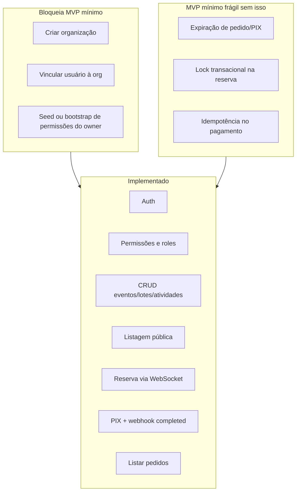

# Gap para MVP funcional

Este documento define o que significa **MVP** para o Knex Flow e lista, com prioridade, o que falta implementar com base no código atual.

---

## Definição de MVP

### MVP mínimo — “vender ingresso de ponta a ponta”

Um organizador consegue, **sem intervenção manual no banco**:

1. Criar conta e configurar uma organização
2. Obter permissões para gerenciar eventos
3. Montar evento (catálogo, lotes, programação)
4. Publicar para compradores

Um participante consegue:

1. Ver eventos da organização
2. Reservar ingresso e pagar via PIX
3. Ter o pedido confirmado automaticamente
4. Consultar seus pedidos/ingressos

### MVP completo — “operar o evento no dia”

Além do mínimo:

1. Participante com ingresso confirmado ocupa vaga em atividade (`event_activity_presences`)
2. Staff faz check-in (`user_presence`)
3. Pedidos/pagamentos expirados liberam tickets
4. Estornos e disputas atualizam order/ticket corretamente

---

## Estado atual vs MVP mínimo



---

## Prioridade P0 — bloqueia MVP mínimo

Sem estes itens, o fluxo organizador **não inicia** pela API.

| #   | Gap                                  | Situação atual                                       | O que implementar                                                                     |
| --- | ------------------------------------ | ---------------------------------------------------- | ------------------------------------------------------------------------------------- |
| 1   | **CRUD de organizações**             | Entidade e repo existem; zero rotas                  | `POST /organizations`, `GET`, `PATCH`; criar `user_organizations` para o founder      |
| 2   | **Membership usuário ↔ org**         | Repo `UserOrganizationRepository` existe; zero rotas | `POST /organizations/:id/members`, `GET`, `DELETE`; validar permissão admin           |
| 3   | **Bootstrap de permissões do owner** | Após criar org, ninguém tem `event:create` etc.      | Ao criar org, atribuir pacote mínimo de permissões ao criador (ou role Admin default) |

**Workaround hoje:** inserir manualmente em `organizations`, `user_organizations` e `user_permissions` via SQL.

---

## Prioridade P1 — MVP mínimo utilizável em produção

Fluxo de venda funciona em dev, mas é **frágil** sem estes itens.

| #   | Gap                             | Situação atual                   | O que implementar                                                                                        |
| --- | ------------------------------- | -------------------------------- | -------------------------------------------------------------------------------------------------------- |
| 4   | **Expiração de pedido e PIX**   | Enums `EXPIRED` existem; sem job | Worker/cron: `PENDING` + timeout → `Order EXPIRED`, `ticket.order_id = null`                             |
| 5   | **Reserva atômica de ticket**   | Read-then-write sem transação    | `UPDATE tickets SET order_id = $1 WHERE id = $2 AND order_id IS NULL RETURNING *` ou `SELECT FOR UPDATE` |
| 6   | **Idempotência em pagamento**   | Dois POST podem criar dois PIX   | Regra: no máximo um `Payment PENDING` por `order_id`; ou chave idempotente                               |
| 7   | **Webhook `completed` robusto** | Implementado de forma básica     | Transação única; tratar replay de webhook                                                                |
| 8   | **Migrations**                  | `DB_SYNCHRONIZE=true`            | TypeORM migrations ou ferramenta equivalente para produção                                               |

---

## Prioridade P2 — MVP completo (dia do evento)

| #   | Gap                                 | Situação atual                                    | O que implementar                                                                                         |
| --- | ----------------------------------- | ------------------------------------------------- | --------------------------------------------------------------------------------------------------------- |
| 9   | **API de convidados**               | `CreateEventInvitedService` sem rota              | `POST/GET/DELETE /events/event-activities/:id/invited`                                                    |
| 10  | **Inscrição em atividade**          | Slots criados vazios; `order_id` nunca preenchido | Serviço: usuário com `Order CONFIRMED` + ticket `USABLE` reserva slot livre em `event_activity_presences` |
| 11  | **`hours_to_retrieve`**             | Campo persistido                                  | Job ou validação na inscrição: só permite retirar vaga dentro da janela                                   |
| 12  | **Check-in**                        | `user_presence` default false                     | `PATCH` para marcar presença (staff com permissão)                                                        |
| 13  | **Validação de ingresso**           | Ausente                                           | Endpoint ou WebSocket: validar ticket `USABLE` no dia do evento                                           |
| 14  | **Webhooks refunded/disputed/lost** | `console.log` apenas                              | Atualizar `Order`, `Payment` e liberar/bloquear ticket conforme `order-status.md`                         |

---

## Prioridade P3 — pós-MVP

| #   | Gap                               | Nota                                                                                             |
| --- | --------------------------------- | ------------------------------------------------------------------------------------------------ |
| 15  | Pagamento cartão (CREDIT/DEBIT)   | DTO e `card_informations` prontos; falta gateway                                                 |
| 16  | Testes automatizados              | `npm test` é placeholder                                                                         |
| 17  | Rate limit WebSocket              | Variáveis no `.env`; implementação no socket não usa `rateLimitEntries` ainda                    |
| 18  | Listagem de pagamentos do usuário | Só `GET /payments/:id`, sem list                                                                 |
| 19  | Cancelamento manual de pedido     | Sem rota                                                                                         |
| 20  | Atribuição de role a usuário      | Roles existem, mas não há `user_organization_roles` — permissões são diretas ou via papel manual |
| 21  | Observabilidade                   | Logs básicos em workers; sem métricas/tracing                                                    |

---

## Checklist MVP mínimo (aceite)

Use como critério de “pronto para demo/produção piloto”:

### Organizador

- [ ] `POST /organizations` cria org e vincula criador
- [ ] Criador recebe permissões para evento/lote/atividade
- [ ] `POST /organizations/:id/activities` — catálogo
- [ ] `POST /events` + `POST /events/batches` — evento com tickets
- [ ] `POST /events/:id/activity` — programação com slots
- [ ] `GET /events?organization_id=` — vitrine pública

### Participante

- [ ] `POST /auth/register` + login
- [ ] WebSocket `retrieve-available-tickets` → `Order PENDING`
- [ ] `POST /payments` → QR PIX
- [ ] Webhook confirma → `Order CONFIRMED`
- [ ] `GET /orders` mostra ingresso utilizável

### Infra

- [ ] Redis + Postgres + AbacatePay configurados
- [ ] Expiração de pedidos (P1) em ambiente real
- [ ] Migrations versionadas (P1) antes de produção

---

## Checklist MVP completo (aceite adicional)

- [ ] Participante inscreve-se em atividade com ingresso confirmado
- [ ] Staff marca check-in
- [ ] PIX expirado libera ticket para nova venda
- [ ] Estorno (`refunded`) libera ticket
- [ ] Disputa bloqueia ticket (`DISPUTED` → `BLOCKED`)

---

## Estimativa de esforço relativo

| Prioridade | Itens                                                           | Esforço                                            |
| ---------- | --------------------------------------------------------------- | -------------------------------------------------- |
| P0         | 3 features (org + membership + bootstrap)                       | Pequeno — entidades prontas, falta HTTP + services |
| P1         | 5 features (expiração, lock, idempotência, webhook, migrations) | Médio — impacto em confiabilidade                  |
| P2         | 6 features (dia do evento + webhooks)                           | Médio/grande — nova superfície de API              |
| P3         | vários                                                          | Contínuo                                           |

---

## Ordem sugerida de implementação

```text
1. POST /organizations + membership + permissões do owner     (P0)
2. Expiração de pedido/PIX                                      (P1)
3. Reserva atômica de ticket                                    (P1)
4. Migrations                                                   (P1)
5. Rotas de convidados                                          (P2)
6. Inscrição em atividade + vínculo order → presence            (P2)
7. Check-in e validação de ingresso                             (P2)
8. Webhooks refunded/disputed/lost                              (P2)
9. Testes do fluxo crítico de compra                            (P3)
```

---

## Referências no código

| Fluxo       | Arquivos principais                                                                                                                                                         |
| ----------- | --------------------------------------------------------------------------------------------------------------------------------------------------------------------------- |
| Reserva     | `get-tickets-avaliability-and-maybe-create-order.service-adapter.ts`, `retrieve-available-tickets.worker.ts`, `find-tickets-avaliability-and-maybe-create-order.service.ts` |
| Pagamento   | `create-payment.service.ts`, `abacatepay-pix-gateway.implementation.ts`                                                                                                     |
| Confirmação | `abacatepay-completed.webhook-handler.ts`                                                                                                                                   |
| Autorização | `authorize-organization-action.service.ts`                                                                                                                                  |
| Programação | `create-event-activity.service.ts`                                                                                                                                          |
| Estados     | `resolve-ticket-avaliability.ts`, enums em `order-status.enum.ts`                                                                                                           |

Schema e relacionamentos: [docs/database](../database/README.md).
