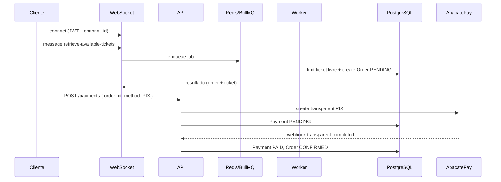
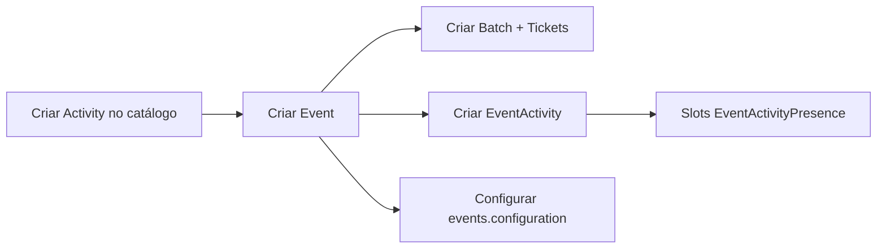

# Visão geral da aplicação

## O que é

Backend do **Knex Flow**: plataforma para organizações produzirem eventos, venderem ingressos em lotes e programarem atividades (palestras, workshops) com controle de vagas e permissões granulares por organização.

Não há frontend neste repositório — esta API é consumida por clientes HTTP e WebSocket (app web, mobile, painel admin).

## Stack

| Camada     | Tecnologia                      |
| ---------- | ------------------------------- |
| Runtime    | Node.js + TypeScript            |
| HTTP       | Express + Celebrate (validação) |
| ORM        | TypeORM + PostgreSQL            |
| Filas      | BullMQ + Redis                  |
| Tempo real | Socket.IO (mesma porta HTTP)    |
| Pagamentos | AbacatePay (PIX transparente)   |
| Arquivos   | MinIO (S3-compatible)           |
| DI         | tsyringe                        |
| Auth       | JWT (access + refresh)          |

Infra local: `docker-compose.yml` sobe Postgres, Redis, MinIO e a app.

## Arquitetura de módulos

```text
src/modules/
├── users/        Auth, organizações (parcial), permissões, roles
├── events/       Eventos, lotes, tickets, pedidos, atividades
├── payments/     PIX, webhooks AbacatePay
└── files/        Upload e metadados de arquivo

src/shared/
├── infra/http/   Server, rotas, middlewares, autorização
├── infra/orm/    DataSource, base entity
├── infra/queue/  BullMQ producer + workers
└── infra/socket/ WebSocket + adapters para filas
```

Todas as entidades usam `BaseEntitySequentialGeneratedUUID`: `id` (UUID v7), `created_at`, `updated_at`, `deleted_at` (soft delete).

## Domínios de negócio

### 1. Identidade e acesso

- Usuário se registra (`POST /auth/register`) ou faz login (`POST /auth/login`).
- Token JWT identifica o usuário nas rotas protegidas (`authMiddleware`).
- `GET /users/me` retorna perfil, permissões e organizações do usuário.
- Na subida do servidor, `SyncPermissionsService` sincroniza a tabela `permissions` com `PermissionDescriptionEnum`.

### 2. Organização e autorização

Modelo **multi-tenant por organização**:

- `user_organizations` — membership (usuário pertence à org).
- `user_permissions` — permissão direta `(user, organization, permission)`.
- `organization_roles` + `organization_role_permissions` — papéis reutilizáveis.

Serviços protegidos chamam `AuthorizeOrganizationActionService`, que verifica membership e permissão antes de mutações (criar evento, lote, etc.).

**Limitação atual:** não há endpoint para criar organização nem para adicionar usuário à organização. Esses vínculos precisam existir no banco manualmente ou via seed.

### 3. Catálogo e programação

```text
Organization
  └── Activity (catálogo: nome, descrição)
  └── Event
        ├── configuration (jsonb)
        ├── Address (opcional, eventos presenciais)
        ├── Batch → Tickets (estoque)
        └── EventActivity (= Activity instanciada no evento)
              ├── EventActivityPresence (slots de vaga)
              └── EventActivityInvited (convidados/palestrantes)
```

- **Activity** é template reutilizável.
- **EventActivity** é a ocorrência no evento (datas, `max_participants`, `hours_to_retrieve`).
- Ao criar `EventActivity`, o sistema gera `max_participants` registros em `event_activity_presences` (slots vazios).

### 4. Comércio (ingressos)

```text
Ticket (order_id = null)  →  disponível
       ↓ reserva (worker)
Order (PENDING) + Ticket.order = Order  →  RESERVED
       ↓ POST /payments (PIX)
Payment (PENDING) + QR Code
       ↓ webhook transparent.completed
Order (CONFIRMED)  →  Ticket USABLE (derivado)
```

- **Ticket** não tem coluna de status. Disponibilidade vem de `resolveTicketAvaliability(ticket)` com base em `order.status`.
- Reserva é **assíncrona**: WebSocket enfileira job → worker executa `GetTicketsAvaliabilityAndMaybeCreateOrderService` → responde no mesmo canal WebSocket.

### 5. Pagamentos

- Gateway registrado: `PixGatewayProvider` → `AbacatepayPixGatewayImplementation`.
- `CreatePaymentService` valida que pedido é do usuário e está `PENDING`, cria pagamento no gateway e persiste `payments`.
- Em `ENVIRONMENT=development`, simula pagamento via `payAbacatepayPix`.
- Webhook `POST /webhook/abacatepay` roteia por evento:
  - `transparent.completed` → **implementado** (atualiza payment + order).
  - `transparent.refunded|disputed|lost` → **stub** (apenas `console.log`).

### 6. Arquivos

- `POST /files` — upload multipart (max 10 MB) para MinIO; retorna URL pública e metadados em `files`.

## Fluxos implementados (diagramas)

### Venda de ingresso (caminho feliz)



### Montagem de evento (organizador)



Pré-requisito: usuário com permissões na organização (`event:create`, `batch:create`, etc.).

## O que a aplicação **não** faz hoje

| Capacidade                                                 | Situação                             |
| ---------------------------------------------------------- | ------------------------------------ |
| Criar organização via API                                  | Ausente (SQL manual no piloto)       |
| Convidar/adicionar membro à organização                    | Ausente                              |
| CRUD de convidados de atividade (`event_activity_invited`) | Implementado                         |
| Vincular pedido confirmado a slot de presença              | Ausente                              |
| Check-in (`user_presence = true`)                          | Ausente                              |
| Lógica de `hours_to_retrieve`                              | Campo persistido, sem automação      |
| Expirar pedido/PIX e liberar ticket                        | Job BullMQ `expire-pending-orders`   |
| Pagamento cartão (CREDIT/DEBIT)                            | Enum e entidade existem, gateway não |
| Webhooks refunded/disputed/lost                            | Stub                                 |
| Testes E2E/unitários                                       | Ausente                              |
| Migrations versionadas                                     | Apenas `synchronize`                 |

## Permissões sincronizadas

Na inicialização, o sistema garante registros em `permissions` para cada valor de `PermissionDescriptionEnum`, incluindo:

- `organization_role:*`, `user_permission:*`
- `activity:*`, `event:*`, `batch:*`
- `event_activity:*`, `event_configuration:*`, `event_invited:*`

Operações de eventos checam permissões como `EVENT_CREATE`, `BATCH_CREATE`, `EVENT_ACTIVITY_CREATE`, etc.

## Infraestrutura necessária para rodar

| Serviço    | Variáveis principais                                            |
| ---------- | --------------------------------------------------------------- |
| PostgreSQL | `DB_*`, `DB_SYNCHRONIZE`                                        |
| Redis      | `BULLMQ_HOST`, `BULLMQ_PORT`                                    |
| AbacatePay | `ABACATEPAY_API_KEY`, `ABACATEPAY_API_URL`, `ABACATEPAY_SECRET` |
| MinIO      | `MINIO_*`                                                       |
| JWT        | `JWT_SECRET`, `JWT_REFRESH_SECRET`                              |

Worker de filas sobe **junto com o HTTP server** (`initializeWorkers` em `server.ts`). Não é necessário processo separado para `RETRIEVE_AVAILABLE_TICKETS` na configuração atual.

## Riscos técnicos conhecidos

Documentados em detalhe no histórico do projeto (filas e order-status):

1. **Race condition na reserva de ticket** — leitura e escrita sem transação/`SELECT FOR UPDATE`.
2. **Fila não elimina corrida sozinha** — múltiplos workers paralelos ainda competem.
3. **Sem idempotência** na criação de pagamento (double-click pode gerar dois PIX).
4. **Sem expiração automática** — pedidos `PENDING` podem segurar tickets indefinidamente.
5. **`DB_SYNCHRONIZE=true`** — inadequado para produção sem migrations.

## Próximo passo

Ver [mvp-gap.md](./mvp-gap.md) para lista priorizada do que implementar para fechar um MVP funcional de ponta a ponta.
