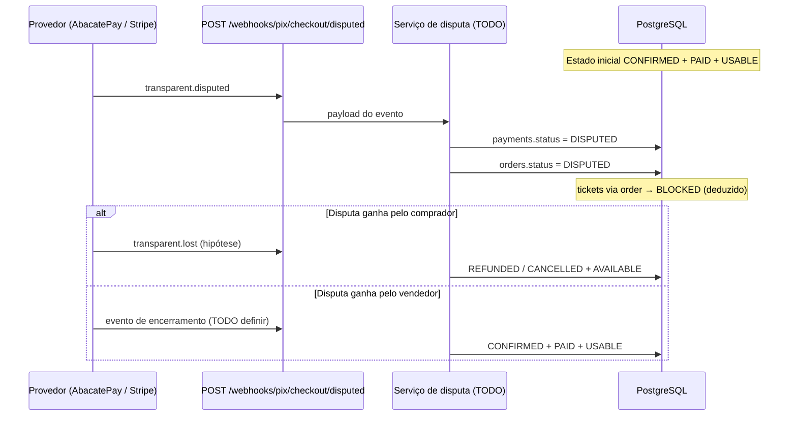

# Fluxo DISPUTED

Mapeamento do fluxo de disputa financeira (chargeback / contestação) no Knex Flow: regra de negócio, modelo de estados e implementação atual no código.

**Referência:** [order-status.md](../business%20rule/order-status.md)

---

## Visão geral

`DISPUTED` existe em duas dimensões persistidas e uma deduzida:

| Dimensão  | Tipo                         | Persistido?             | Papel no fluxo                                         |
| --------- | ---------------------------- | ----------------------- | ------------------------------------------------------ |
| Pagamento | `PaymentStatus.DISPUTED`     | Sim (`payments.status`) | Estado financeiro da tentativa no provedor             |
| Pedido    | `OrderStatus.DISPUTED`       | Sim (`orders.status`)   | Estado comercial da compra                             |
| Ticket    | `TicketAvailability.BLOCKED` | Não (calculado)         | Bloqueio operacional enquanto a disputa estiver aberta |

Tickets **não** têm coluna de status. A disponibilidade vem de `order.status` via `resolveTicketAvaliability`.

---

## Pré-condição

A disputa só faz sentido após uma compra já confirmada:

```text
PENDING → CONFIRMED → DISPUTED
              ↑
         (pagamento PAID / captura ok)
```

| Antes da disputa  | PaymentStatus | OrderStatus | TicketAvailability |
| ----------------- | ------------- | ----------- | ------------------ |
| Compra confirmada | `PAID`        | `CONFIRMED` | `USABLE`           |

**Gatilho de negócio:** chargeback ou disputa aberta no provedor (Stripe, AbacatePay, etc.).

---

## Estado alvo (regra de negócio)

Quando a disputa é **aberta**:

| Dimensão | Status     |
| -------- | ---------- |
| Payment  | `DISPUTED` |
| Order    | `DISPUTED` |
| Ticket   | `BLOCKED`  |

Significado:

- **Payment `DISPUTED`:** valor contestado; liquidação em risco.
- **Order `DISPUTED`:** compra em disputa financeira; não tratar como venda estável.
- **Ticket `BLOCKED`:** ingresso não deve ser usado/revendido até resolução.

---

## Diagrama do fluxo (alvo)



---

## Fluxo textual (documentado)

```text
CONFIRMED ──(chargeback aberto)──► DISPUTED
                                      │
                    ┌─────────────────┴─────────────────┐
                    ▼                                   ▼
            (resolução a favor                    (resolução a favor
             do comprador — TODO)                  do vendedor — TODO)
                    │                                   │
                    ▼                                   ▼
              REFUNDED / CANCELLED                  CONFIRMED
              Ticket AVAILABLE                      Ticket USABLE
```

Transições de saída de `DISPUTED` **não estão implementadas** nem totalmente especificadas em `order-status.md`. O webhook `lost` sugere disputa perdida pelo merchant (ver seção [Webhooks relacionados](#webhooks-relacionados)).

---

## Implementação atual no código

### O que existe

| Artefato                          | Caminho                                                          | Situação                     |
| --------------------------------- | ---------------------------------------------------------------- | ---------------------------- |
| Enum `OrderStatus.DISPUTED`       | `src/modules/events/infra/orm/enums/order-status.enum.ts`        | Definido                     |
| Enum `PaymentStatus.DISPUTED`     | `src/modules/payments/enums/payment-status.enum.ts`              | Definido                     |
| Enum `TicketAvailability.BLOCKED` | `src/modules/events/infra/orm/enums/ticket-availability.enum.ts` | Definido                     |
| Resolver de ticket                | `src/modules/events/utils/resolve-ticket-avaliability.ts`        | `DISPUTED` → `BLOCKED`       |
| Rota de webhook                   | `POST /webhooks/pix/checkout/disputed`                           | Stub (202, sem persistência) |
| Postman                           | `Checkout - disputed` em `docs/postman collection/`              | Request de teste             |

### O que não existe (lacunas)

| Lacuna                                                                              | Impacto                                             |
| ----------------------------------------------------------------------------------- | --------------------------------------------------- |
| Nenhum serviço atualiza `orders.status` para `DISPUTED`                             | Pedido nunca entra em disputa via API               |
| Nenhum serviço atualiza `payments.status` para `DISPUTED`                           | Pagamento nunca reflete disputa                     |
| `HooksController.onDisputed` só ecoa payload                                        | Webhook não altera banco                            |
| `PaymentProcessorService` com `TODO`                                                | Fila `PAYMENT_PROCESSING` não processa disputa      |
| `resolveTicketAvaliability` **não é importado** em nenhum service/controller/mapper | `BLOCKED` nunca aparece em respostas HTTP           |
| Sem validação de pré-condição (`CONFIRMED` + `PAID`)                                | Risco de transição inválida quando implementar      |
| Sem idempotência / correlação por `order_id` ou `payment_id` no webhook             | Reprocessamento pode duplicar efeitos               |
| Saída de `DISPUTED` (ganhou/perdeu disputa) indefinida                              | `lost`, `refunded` e retorno a `CONFIRMED` sem spec |

---

## Entrada HTTP (única hoje)

```
POST /webhooks/pix/checkout/disputed
```

- **Router:** `src/modules/payments/infra/http/hooks/checkout.hooks.ts`
- **Controller:** `src/modules/payments/infra/http/controllers/hooks.controller.ts` → `onDisputed`
- **Auth:** rota **fora** de `authMiddleware` (`src/shared/infra/http/routes/index.ts`)
- **Resposta atual:** `202` + `{ accepted: true, event: 'transparent.disputed', ... }`
- **Provedor documentado no stub:** `ABACATEPAY`, fluxo `transparent_checkout`

---

## Webhooks relacionados

Mesmo padrão stub; nenhum persiste status:

| Rota                 | Evento                  | Relação com DISPUTED                              |
| -------------------- | ----------------------- | ------------------------------------------------- |
| `POST .../completed` | `transparent.completed` | Antecede disputa (`CONFIRMED`)                    |
| `POST .../disputed`  | `transparent.disputed`  | **Abre** disputa                                  |
| `POST .../refunded`  | `transparent.refunded`  | Possível desfecho (estorno)                       |
| `POST .../lost`      | `transparent.lost`      | Possível desfecho (disputa perdida pelo merchant) |
| `POST .../event`     | genérico                | Catch-all                                         |

---

## Modelo de dados

```text
orders (status: enum OrderStatus)
  ├── payments[] (status: enum PaymentStatus)
  └── tickets[] (sem status; availability via order.status)
```

**Consulta com contexto de disputa:** `TicketRepository.find` já faz:

```text
ticket → order → payments (ORDER BY payments.created_at DESC)
```

Arquivo: `src/modules/events/infra/orm/repositories/implementations/ticket-repository.implementation.ts`

Útil para, ao implementar, pegar o pagamento mais recente e validar transição para `DISPUTED`.

---

## Resolver de ticket (DISPUTED)

```typescript
// src/modules/events/utils/resolve-ticket-avaliability.ts
case OrderStatus.DISPUTED:
  return TicketAvailability.BLOCKED;
```

**Uso atual:** nenhum import no projeto. Qualquer endpoint que devolva ticket precisará chamar este util (ou mapper equivalente) para expor `availability`.

---

## Implementação sugerida (backlog)

Ordem sugerida para fechar o fluxo:

1. **DTO + contrato** do payload `transparent.disputed` (AbacatePay): ids de pagamento/pedido no gateway.
2. **`HandleDisputedWebhookService`** (ou estender `PaymentProcessorService`):
   - Localizar `Payment` + `Order` por id externo ou `order_id`.
   - Validar: `order.status === CONFIRMED` e pagamento relevante `=== PAID`.
   - Atualizar em transação: `payment.status = DISPUTED`, `order.status = DISPUTED`.
3. **Idempotência:** ignorar se já `DISPUTED`.
4. **Wire no `HooksController.onDisputed`:** chamar serviço em vez de só `202`.
5. **Respostas de API de ticket:** usar `resolveTicketAvaliability` no mapper de resposta.
6. **Definir desfechos** e implementar:
   - `lost` → provável `REFUNDED` + ticket `AVAILABLE`
   - disputa encerrada a favor do vendedor → `CONFIRMED` + `PAID` + `USABLE`
7. **Testes** de integração: webhook → estados no banco → availability.

---

## Matriz de referência (chargeback aberto)

| PaymentStatus | OrderStatus | TicketAvailability |
| ------------- | ----------- | ------------------ |
| `DISPUTED`    | `DISPUTED`  | `BLOCKED`          |

---

## Arquivos tocados pelo fluxo

| Arquivo                                                           | Papel                             |
| ----------------------------------------------------------------- | --------------------------------- |
| `src/modules/events/infra/orm/enums/order-status.enum.ts`         | `DISPUTED` no pedido              |
| `src/modules/payments/enums/payment-status.enum.ts`               | `DISPUTED` no pagamento           |
| `src/modules/events/infra/orm/enums/ticket-availability.enum.ts`  | `BLOCKED`                         |
| `src/modules/events/utils/resolve-ticket-avaliability.ts`         | Deduz disponibilidade             |
| `src/modules/events/infra/orm/entities/order.entity.ts`           | Coluna `status`                   |
| `src/modules/payments/infra/orm/entities/payment.entity.ts`       | Coluna `status`                   |
| `src/modules/payments/infra/http/hooks/checkout.hooks.ts`         | Rota `/disputed`                  |
| `src/modules/payments/infra/http/controllers/hooks.controller.ts` | Handler stub                      |
| `src/shared/infra/http/routes/index.ts`                           | Montagem `/webhooks/pix/checkout` |
| `docs/business rule/order-status.md`                              | Regra e matriz de casos           |

---

## Resumo executivo

| Pergunta                 | Resposta                                                               |
| ------------------------ | ---------------------------------------------------------------------- |
| O fluxo está completo?   | **Não** — só enums, doc e endpoint stub                                |
| Como entra disputa hoje? | Apenas `POST /webhooks/pix/checkout/disputed` (sem efeito no banco)    |
| Ticket fica bloqueado?   | Só na regra; código do resolver existe mas **não é usado** em HTTP     |
| Próximo passo crítico    | Serviço que persista `DISPUTED` no payment + order a partir do webhook |
